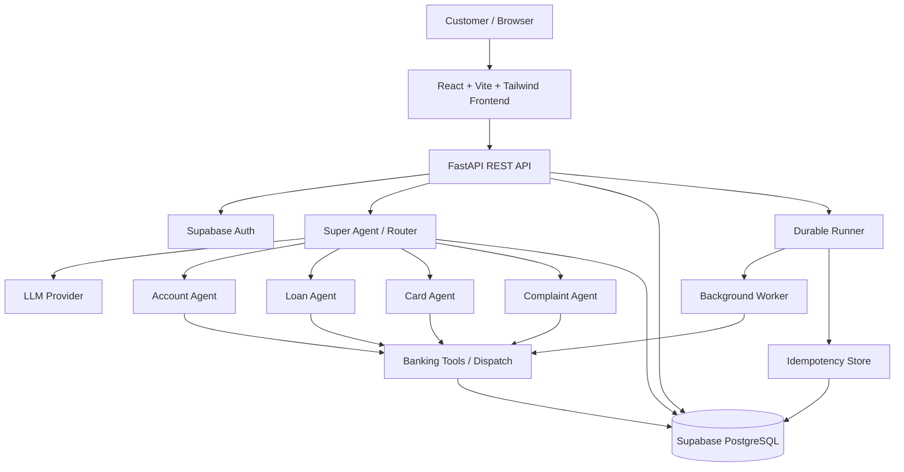
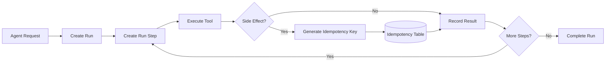

# SmartBank AI Assistant — System Architecture

## 1. Overview

SmartBank AI Assistant is a full-stack banking chatbot built with React, FastAPI, Supabase/PostgreSQL, and an LLM-powered multi-agent layer. The system receives customer requests through the web application, authenticates the customer, routes requests through a Super Agent, and delegates banking tasks to specialist agents and tools.

## 2. High-Level Architecture



## 3. Frontend Layer

The frontend is implemented with React and Vite.

- `App.jsx` — application routing and page selection.
- `AuthContext.jsx` — authentication state and token storage.
- `LoginPage.jsx` / `SignupPage.jsx` — authentication UI.
- `ChatPages.jsx` — chat threads, messages, and customer interaction.
- `AgentPanel.jsx` — agent activity, run information, and statistics.
- `services/api.js` — Axios API client and authorization header handling.

The frontend communicates with the backend through the `/api` proxy configured by Vite.

## 4. API Layer

FastAPI provides the backend REST interface.

Main route groups:

- `/api/auth/*` — signup, login, and logout.
- `/api/chat/*` — threads, messages, and sending chat requests.
- `/api/agents/*` — agent logs, runs, and statistics.

The backend is responsible for authentication, request validation, orchestration, persistence, and communication with the banking domain layer.

## 5. Authentication

Supabase Auth manages customer authentication and sessions. The frontend stores the returned access token and sends it as a Bearer token with API requests.

The application also maintains a `customer` record in PostgreSQL for banking-domain information.

## 6. Multi-Agent Layer

### Super Agent

The Super Agent receives the conversation context and determines which agent should handle the request.

It can route requests to:

- Account Agent
- Loan Agent
- Card Agent
- Complaint Agent

For simple conversational requests, it may produce a direct response.

### Specialist Agents

**Account Agent**
- Account balances
- Recent transactions
- Account statements
- Customer profile information

**Loan Agent**
- Loan eligibility
- EMI calculations
- Loan applications

**Card Agent**
- Card information
- Card status
- Blocking/unblocking cards
- Card statements

**Complaint Agent**
- File complaints
- Retrieve complaints
- Escalate complaints

## 7. Tool Layer

Specialist agents use typed banking tools to interact with the banking data layer.

The tool-dispatch layer discovers public tool methods and converts model-generated tool arguments into Python values before execution.

Side-effecting operations include actions such as:

- Applying for a loan
- Blocking or unblocking a card
- Filing a complaint
- Escalating a complaint

## 8. Data Layer

Supabase PostgreSQL stores both banking data and agent-execution data.

### Banking tables

- `customer`
- `account`
- `transaction`
- `loan`
- `card`
- `complaint`

### Agent/runtime tables

- `thread`
- `message`
- `agent_log`
- `run`
- `run_step`
- `idempotency`

The project also contains `BankDb`, a typed data-access layer for common banking operations.

## 9. Durable Execution

The project contains a durable execution architecture for reliable agent workflows.



The runner records execution state and uses idempotency keys for side-effecting tools. The worker provides background execution, retry, leasing, and failure-handling infrastructure.

## 10. Memory and Conversations

Conversation state is persisted using `thread` and `message` records. The memory layer loads recent messages and converts them into the message format expected by the LLM provider.

Each message belongs to a thread and contains ordering information so the agent can reconstruct conversation context.

## 11. LLM Provider Layer

The provider abstraction allows the application to communicate with an OpenAI-compatible LLM API.

The current configuration supports:

- Configurable API key
- Configurable base URL
- Configurable model
- Tool-call responses
- Scripted provider for testing
- Echo provider for testing

No API keys are stored in source code. Runtime credentials belong in `.env`, which is excluded from Git.

## 12. Request Flow

A typical request follows this path:

```text
Customer
  ↓
React Chat UI
  ↓
FastAPI /api/chat/send
  ↓
Conversation / Run persistence
  ↓
Super Agent
  ↓
Specialist Agent
  ↓
Banking Tool
  ↓
Supabase PostgreSQL
  ↓
Tool Result
  ↓
Agent Response
  ↓
FastAPI
  ↓
React Chat UI
```

## 13. Security Boundaries

The production design should enforce these boundaries:

1. Authentication is verified on protected API endpoints.
2. Customer identity must be derived from the authenticated session rather than a client-supplied customer ID.
3. Every thread, message, account, card, loan, and complaint operation must verify customer ownership.
4. Service-role credentials must remain server-side.
5. Full card numbers and other sensitive banking information should not be exposed unnecessarily.
6. `.env` files and credentials must never be committed to Git.
7. Side-effecting operations should require explicit confirmation where appropriate.

## 14. Technology Stack

| Layer | Technology |
|---|---|
| Frontend | React 18, Vite, Tailwind CSS |
| API | FastAPI, Uvicorn |
| Authentication | Supabase Auth |
| Database | Supabase PostgreSQL |
| Agent orchestration | Python multi-agent architecture |
| LLM interface | OpenAI-compatible API |
| HTTP client | Axios / HTTPX |
| Testing | Pytest |
| Runtime | Python 3.12 |

## 15. Repository Structure

```text
my-project/
├── backend/
│   ├── app/
│   │   ├── agents/
│   │   ├── routes/
│   │   ├── bank_db.py
│   │   ├── database.py
│   │   ├── idempotency.py
│   │   ├── memory.py
│   │   ├── providers.py
│   │   ├── runner.py
│   │   └── worker.py
│   ├── tests/
│   ├── .env.example
│   └── requirements.txt
├── frontend/
│   ├── src/
│   │   ├── components/
│   │   ├── context/
│   │   ├── pages/
│   │   └── services/
│   ├── package.json
│   └── vite.config.js
├── schema/
│   ├── bank.sql
│   ├── agent.sql
│   └── seed.sql
├── scripts/
├── docs/
│   └── system-architecture.md
├── .gitignore
└── README
```

## 16. Important Implementation Note

The repository contains both a synchronous chat execution path and a durable runner/worker architecture. Before production deployment, the application should consistently route side-effecting workflows through the durable execution path and enforce authentication, ownership, confirmation, and atomic idempotency at the backend boundary.
